# LinkedIn Slop Bot 🤖

Transform your images and ideas into highly engaging LinkedIn "slop" content that maximizes engagement through authentic, relatable, and strategically imperfect posts.

## 🚀 Quick Start

### 1. Set up your NVIDIA API key
```bash
export NVIDIA_API_KEY="your_api_key_here"
```

### 2. Basic Usage

```python
from linkedin_agent import create_linkedin_post

# Text-only post
result = create_linkedin_post(
    initial_prompt="Create a motivational post about learning new skills in tech",
    post_type="motivation"
)

# With image
result = create_linkedin_post(
    initial_prompt="Share insights about remote work productivity",
    image_path="path/to/your/image.jpg",
    post_type="industry_insight"
)

print(result["final_post"])
```

### 3. Test the Agent
```bash
cd /home/ubuntu/build-an-agent/code/linkedin_agent
python -m linkedin_agent
```

## 🎯 Features

### ✅ MVP (Available Now)
- **Image Analysis** - Uses Mistral Medium 3 to analyze images for LinkedIn content
- **Content Generation** - Creates engaging "slop" content with Llama 3.3 70B
- **Markdown Formatting** - Clean output ready for LinkedIn
- **Multiple Post Types** - Support for different content styles

### 🔄 Coming Soon (Medium Priority)
- Question Sub-Agent for content refinement
- Critiquer Agent for quality improvement  
- Research Integration for trending topics
- Author-Critiquer refinement loop

### ⏳ Future Enhancements
- Advanced slop style templates
- OCR integration for text in images
- Multi-model comparison and A/B testing
- Analytics and performance tracking

## 🏗️ Architecture

```mermaid
graph TD
    A[🎯 User Input<br/>Image + Prompt] --> B[📊 Questionnaire Sub-Agent<br/>Style Preferences]
    B --> C{🔍 Image Available?}
    C -->|Yes| D[🖼️ Image Context Analyzer<br/>Vision-Language Model]
    C -->|No| E[🏭 Industry Analyzer Sub-Agent<br/>Domain Classification]
    D --> E
    E --> F[🔍 Web Research Tool<br/>Trending Topics & Hashtags]
    F --> G[✍️ Author Agent<br/>Content Generation]
    G --> H[🎯 Critiquer Sub-Agent<br/>Quality Assessment]
    H --> I{📈 Quality Score ≥ 7.5?}
    I -->|No| J[🔄 Refinement Loop<br/>Iterative Improvement]
    J --> G
    I -->|Yes| K[📝 Markdown Formatter<br/>Final Output]
    K --> L[🎉 LinkedIn Post Ready!]
    
    style A fill:#ff6b6b,stroke:#d63031,stroke-width:3px,color:#fff
    style B fill:#74b9ff,stroke:#0984e3,stroke-width:2px,color:#fff
    style D fill:#a29bfe,stroke:#6c5ce7,stroke-width:2px,color:#fff
    style E fill:#fd79a8,stroke:#e84393,stroke-width:2px,color:#fff
    style F fill:#fdcb6e,stroke:#e17055,stroke-width:2px,color:#fff
    style G fill:#00b894,stroke:#00a085,stroke-width:2px,color:#fff
    style H fill:#e17055,stroke:#d63031,stroke-width:2px,color:#fff
    style I fill:#6c5ce7,stroke:#5f3dc4,stroke-width:2px,color:#fff
    style J fill:#fd79a8,stroke:#e84393,stroke-width:2px,color:#fff
    style K fill:#00cec9,stroke:#00b894,stroke-width:2px,color:#fff
    style L fill:#00b894,stroke:#00a085,stroke-width:3px,color:#fff
```



## 📁 File Structure

```
linkedin_agent/
├── __init__.py              # Main entry point
├── linkedin_state.py        # State model for the workflow
├── linkedin_agent.py        # LangGraph workflow orchestrator
├── image_analyzer.py        # Image-to-text analysis
├── linkedin_author.py       # Content generation & formatting
├── tools.py                 # Image processing and LinkedIn tools
├── prompts.py              # All prompts and slop templates
├── __main__.py             # Test runner
└── README.md               # This file
```

## 🎭 LinkedIn "Slop" Style

Our bot creates content with these authentic characteristics:
- ✅ Vulnerability and relatability
- ✅ Strategic imperfections for authenticity
- ✅ Humble bragging disguised as lessons
- ✅ Engagement bait questions
- ✅ Transformation stories
- ✅ "Controversial" takes that aren't actually controversial

## 🔧 Configuration

### Environment Variables
```bash
NVIDIA_API_KEY=your_api_key_here
TAVILY_API_KEY=your_tavily_key_here  # For research features
```

### Post Types
- `general` - Basic LinkedIn content
- `motivation` - Motivational/inspirational posts
- `industry_insight` - Industry-specific insights
- `personal_story` - Personal transformation stories

## 🐛 Troubleshooting

### Common Issues

**Import Error**: Make sure you're in the right directory and have all dependencies installed
```bash
cd /home/ubuntu/build-an-agent/code
pip install -r ../requirements.txt
```

**API Key Error**: Ensure your NVIDIA API key is set correctly
```bash
echo $NVIDIA_API_KEY
```

**Image Processing Error**: Make sure Pillow is installed and image path is correct
```bash
pip install pillow>=10.0.0
```

## 📈 Next Steps

1. **Test the MVP** - Run the basic workflow
2. **Add Custom Images** - Try with your own images
3. **Experiment with Prompts** - Test different content styles
4. **Extend the Workflow** - Add question/research agents

---

**Ready to create some authentic LinkedIn slop?** 🚀 