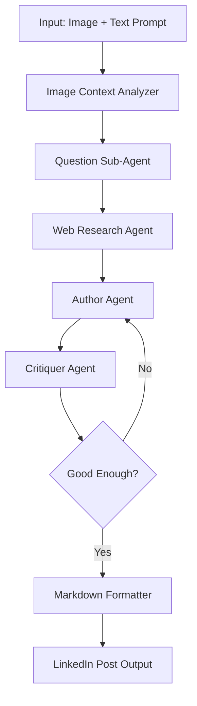

# LinkedIn Slop Bot Implementation Plan

## 🎯 Project Overview

Transform the existing `docgen_agent` into a **LinkedIn Slop Bot** that generates highly engaging but intentionally "sloppy" LinkedIn content. The bot will use NVIDIA AI models to create posts that maximize engagement through authentic, relatable, and slightly imperfect content.

## 🏗️ Architecture Overview

### Current State → Target State
- **FROM**: Document generation with research → planning → writing
- **TO**: Image analysis → questioning → research → author/critiquer loop → LinkedIn post

### Core Agent Flow


## 🔧 Implementation Plan

### Phase 1: Core Infrastructure Setup

#### 1.1 Update Dependencies
```python
# Add to requirements.txt
pillow>=10.0.0          # Image processing
base64                  # Image encoding
requests>=2.31.0        # HTTP requests for image handling
```

#### 1.2 NVIDIA Model Selection
**Final Models from build.nvidia.com:**

### **🖼️ Vision Models**
1. **Image Analysis**: `mistralai/mistral-medium-3-instruct` - For image-to-text description
2. **Backup Vision**: `nvidia/vila` (40B) - If we need more detailed vision analysis

### **📝 Text Models**  
3. **Question Generation**: `meta/llama-3.3-70b-instruct` - Reasoning and question formulation
4. **Author Agent**: `meta/llama-3.3-70b-instruct` - Creative LinkedIn content generation  
5. **Critiquer Agent**: `meta/llama-3.3-70b-instruct` - Analysis and critique
6. **Research Synthesis**: `meta/llama-3.3-70b-instruct` - Processing research results

### **🔧 Utility Models**
7. **Embeddings**: `nvidia/nv-clip` - For semantic search and similarity
8. **OCR Backup**: `microsoft/phi-3.5-vision-instruct` - If we need text extraction from images

### **📋 Model Usage Strategy**
- **Primary Stack**: Mistral Medium 3 (vision) + Llama 3.3 70B (text processing)
- **Consistent API**: All through NVIDIA API endpoints  
- **Performance**: Focus on Llama 3.3 70B for complex reasoning tasks
- **Backup Options**: VILA for advanced vision, phi-3.5 for OCR if needed

### **🎯 Agent-to-Model Mapping**
| Agent | Model | Purpose |
|-------|-------|---------|
| **Image Analyzer** | `mistralai/mistral-medium-3-instruct` | Convert image to detailed text description |
| **Question Generator** | `meta/llama-3.3-70b-instruct` | Generate strategic clarifying questions |
| **LinkedIn Researcher** | `meta/llama-3.3-70b-instruct` | Process and synthesize research results |
| **Author Agent** | `meta/llama-3.3-70b-instruct` | Generate engaging LinkedIn "slop" content |
| **Critiquer Agent** | `meta/llama-3.3-70b-instruct` | Critique and score content for improvement |
| **Formatter** | `meta/llama-3.3-70b-instruct` | Format final output as markdown |

**Why Llama 3.3 70B for text tasks?**
- Excellent at creative writing and content generation
- Strong reasoning capabilities for critique and analysis  
- Consistent performance across different prompting styles
- Good at following complex instructions and formatting

#### 1.3 New State Models
```python
# linkedin_agent_state.py
class LinkedInAgentState(BaseModel):
    # Input
    image_path: str | None = None
    image_base64: str | None = None
    initial_prompt: str
    
    # Image Analysis
    image_description: str | None = None
    visual_elements: list[str] = []
    
    # Question Phase
    clarifying_questions: list[str] = []
    user_responses: dict[str, str] = {}
    
    # Research Phase
    research_queries: list[str] = []
    research_results: str | None = None
    
    # Content Creation
    post_drafts: list[str] = []
    critique_feedback: list[str] = []
    final_post: str | None = None
    
    # Metadata
    target_engagement_style: str = "relatable_slop"
    post_type: str = "general"  # general, motivation, industry_insight, personal_story
    
    messages: Annotated[Sequence[Any], add_messages] = []
```

### Phase 2: Agent Implementation

#### 2.1 Image Context Analyzer Agent
```python
# image_analyzer.py
async def image_context_analyzer(state: LinkedInAgentState, config: RunnableConfig):
    """Analyze uploaded image to extract context and visual elements."""
    
    # Primary model: Mistral Medium 3 for image-to-text analysis
    vision_model = ChatNVIDIA(model="mistralai/mistral-medium-3-instruct")
    
    # Backup vision model if needed for more detailed analysis
    backup_vision_model = ChatNVIDIA(model="nvidia/vila")
    
    # OCR model for text detection in images (if needed)
    ocr_model = ChatNVIDIA(model="microsoft/phi-3.5-vision-instruct")
    
    analysis_prompt = """
    Analyze this image for LinkedIn content creation. Provide a detailed analysis:
    
    🎯 VISUAL ELEMENTS:
    - Main subjects/people (describe their appearance, expressions, activities)
    - Objects and props visible
    - Text or signage present
    - Color palette and visual style
    
    🌍 SETTING & CONTEXT:
    - Location/environment (office, home, outdoor, etc.)
    - Time of day/lighting
    - Professional vs personal setting
    - Industry context clues
    
    😊 EMOTIONAL TONE:
    - Mood conveyed (professional, casual, celebratory, reflective)
    - Energy level (high, calm, intense)
    - Authenticity level (staged vs candid)
    
    💼 LINKEDIN ANGLES:
    - Career development opportunities
    - Leadership/teamwork themes
    - Industry insights possible
    - Personal branding potential
    - Motivational messaging angles
    - Humble-brag opportunities
    
    🎭 SLOP POTENTIAL:
    - Relatability factors
    - Vulnerability moments
    - "Behind the scenes" elements
    - Transformation/before-after potential
    
    Format as structured analysis with clear categories.
    """
    
    # Process image with base64 encoding for API
    image_b64 = await encode_image_to_base64(state.image_path or state.image_base64)
    
    response = await vision_model.ainvoke([
        {
            "role": "user", 
            "content": [
                {"type": "text", "text": analysis_prompt},
                {"type": "image_url", "image_url": {"url": f"data:image/jpeg;base64,{image_b64}"}}
            ]
        }
    ], config)
    
    # Update state with analysis
    state.image_description = response.content
    
    return {"image_description": response.content, "messages": [response]}
```

#### 2.2 Question Sub-Agent
```python
# questioner.py
async def question_sub_agent(state: LinkedInAgentState, config: RunnableConfig):
    """Generate clarifying questions to refine content direction."""
    
    model = ChatNVIDIA(model="meta/llama-3.3-70b-instruct")
    
    prompt = f"""
    Based on this context:
    - Image: {state.image_description}
    - Initial prompt: {state.initial_prompt}
    
    Generate 3-5 strategic questions to create engaging LinkedIn content:
    
    1. Target audience questions
    2. Content angle/perspective questions  
    3. Engagement style questions
    4. Call-to-action questions
    
    Make questions that will help create authentic, relatable "slop" content.
    """
```

#### 2.3 Enhanced Research Agent
```python
# linkedin_researcher.py (extends existing researcher.py)
async def linkedin_research_agent(state: LinkedInAgentState, config: RunnableConfig):
    """Research trending topics, engagement patterns, and relevant industry content."""
    
    research_queries = [
        f"{state.user_responses.get('industry', 'business')} LinkedIn trending topics 2024",
        f"high engagement LinkedIn post examples {state.post_type}",
        f"LinkedIn algorithm best practices {datetime.now().year}",
        # Dynamic queries based on image content and user responses
    ]
    
    # Use existing Tavily search with LinkedIn-specific focus
```

#### 2.4 LinkedIn Author Agent
```python
# linkedin_author.py
async def linkedin_author_agent(state: LinkedInAgentState, config: RunnableConfig):
    """Generate LinkedIn post content with intentional 'slop' characteristics."""
    
    model = ChatNVIDIA(model="meta/llama-3.3-70b-instruct")
    
    slop_characteristics = """
    LinkedIn "Slop" Style Guidelines:
    ✅ Authentic vulnerability and relatability
    ✅ Slightly imperfect grammar for authenticity
    ✅ Overuse of emojis and line breaks
    ✅ Humble bragging disguised as lessons learned
    ✅ Vague motivational statements
    ✅ "Controversial" takes that aren't actually controversial
    ✅ Personal anecdotes with business lessons
    ✅ Engagement bait questions
    ✅ Industry buzzwords used incorrectly
    ✅ Fake modesty combined with obvious self-promotion
    """
    
    prompt = f"""
    Create a LinkedIn post with these elements:
    
    Context:
    - Image description: {state.image_description}
    - User intent: {state.initial_prompt}
    - Research insights: {state.research_results}
    - User preferences: {state.user_responses}
    
    Style: {slop_characteristics}
    
    Structure:
    1. Hook (controversial or relatable opening)
    2. Personal story/anecdote 
    3. Business lesson/insight
    4. Call to action/engagement question
    5. Hashtags (mix of relevant and trend-chasing)
    
    Make it engaging but authentically "LinkedIn sloppy"
    """
```

#### 2.5 Critiquer Agent
```python
# linkedin_critiquer.py
async def linkedin_critiquer_agent(state: LinkedInAgentState, config: RunnableConfig):
    """Critique and suggest improvements for LinkedIn engagement."""
    
    model = ChatNVIDIA(model="meta/llama-3.3-70b-instruct")
    
    critique_framework = """
    Evaluate the LinkedIn post on:
    
    📊 ENGAGEMENT POTENTIAL (1-10):
    - Hook strength and curiosity gap
    - Emotional resonance and relatability
    - Comment-bait effectiveness
    - Share-worthiness
    
    🎭 SLOP AUTHENTICITY (1-10):
    - Appropriate level of humble bragging
    - Authentic vulnerability vs cringe
    - Buzzword usage (not too professional)
    - Emoji and formatting "mistakes"
    
    🎯 ALGORITHM OPTIMIZATION (1-10):
    - Optimal post length
    - Question placement for comments
    - Hashtag strategy
    - Time-sensitive relevance
    
    Provide specific suggestions for improvement.
    """
```

### Phase 3: Workflow Integration

#### 3.1 Main Agent Orchestrator
```python
# linkedin_agent.py
workflow = StateGraph(LinkedInAgentState)

# Sequential nodes
workflow.add_node("image_analyzer", image_context_analyzer)
workflow.add_node("questioner", question_sub_agent)
workflow.add_node("researcher", linkedin_research_agent)
workflow.add_node("author", linkedin_author_agent)
workflow.add_node("critiquer", linkedin_critiquer_agent)
workflow.add_node("formatter", markdown_formatter)

# Conditional edges for refinement loop
workflow.add_conditional_edges(
    "critiquer",
    should_continue_refining,
    {
        "continue": "author",
        "finish": "formatter"
    }
)

# Main flow
workflow.add_edge(START, "image_analyzer")
workflow.add_edge("image_analyzer", "questioner")  
workflow.add_edge("questioner", "researcher")
workflow.add_edge("researcher", "author")
workflow.add_edge("author", "critiquer")
workflow.add_edge("formatter", END)
```

#### 3.2 Refinement Loop Logic
```python
def should_continue_refining(state: LinkedInAgentState) -> str:
    """Determine if post needs more refinement."""
    
    # Stop conditions:
    if len(state.post_drafts) >= 5:  # Max iterations
        return "finish"
    
    if state.critique_feedback and len(state.critique_feedback) > 0:
        latest_scores = extract_scores(state.critique_feedback[-1])
        if all(score >= 7 for score in latest_scores.values()):
            return "finish"
    
    return "continue"
```

### Phase 4: Tools and Utilities

#### 4.1 Image Processing Tools
```python
# tools/image_tools.py
@tool
async def process_image_upload(image_path: str) -> dict:
    """Process uploaded image for analysis."""
    
@tool  
async def image_to_base64(image_path: str) -> str:
    """Convert image to base64 for API calls."""

@tool
async def extract_image_metadata(image_path: str) -> dict:
    """Extract EXIF and metadata from image."""
```

#### 4.2 LinkedIn-Specific Research Tools
```python
# tools/linkedin_tools.py
@tool
async def get_trending_hashtags(industry: str) -> list[str]:
    """Get trending hashtags for specific industry."""

@tool
async def analyze_competitor_posts(company_name: str) -> dict:
    """Analyze successful posts from competitors."""

@tool
async def get_engagement_patterns(post_type: str) -> dict:
    """Get optimal posting patterns for engagement."""
```

### Phase 5: User Interface

#### 5.1 Jupyter Notebook Interface
```python
# linkedin_client.ipynb
def create_linkedin_post_interface():
    """Interactive widget interface for LinkedIn post creation."""
    
    # File upload widget for images
    # Text input for initial prompt
    # Dynamic question/answer interface
    # Real-time preview of generated content
    # Export options (markdown, plain text, formatted)
```

#### 5.2 CLI Interface
```python
# __main__.py update
def main():
    parser = argparse.ArgumentParser(description="LinkedIn Slop Bot")
    parser.add_argument("--image", help="Path to image file")
    parser.add_argument("--prompt", help="Initial content prompt")
    parser.add_argument("--interactive", action="store_true", help="Interactive mode")
    
    # Implementation for CLI usage
```

### Phase 6: Prompts and Templates

#### 6.1 Slop Style Templates
```python
# prompts/linkedin_prompts.py

SLOP_TEMPLATES = {
    "motivation_monday": """
        Monday motivation: {hook}
        
        Last week I {humble_brag_story}...
        
        The lesson? {vague_business_insight}
        
        What's YOUR Monday motivation? 👇
        
        #MondayMotivation #Leadership #Growth #Mindset
    """,
    
    "industry_insight": """
        Unpopular opinion: {controversial_take}
        
        Here's why this matters for {industry}...
        
        {pseudo_expert_analysis}
        
        Agree or disagree? Let me know in the comments!
        
        #{Industry} #Innovation #FutureOfWork #Thoughts
    """,
    
    "personal_story": """
        3 years ago, I was {humble_beginning}...
        
        Today, I {achievement_with_fake_modesty}...
        
        The journey taught me {generic_lesson}...
        
        Sometimes you just need to {motivational_cliche}...
        
        What's been your biggest career lesson? Share below! ⬇️
        
        #CareerGrowth #PersonalDevelopment #Success #Journey
    """
}
```

## 🚀 Quick Start Guide

### Immediate Next Steps (Day 1)
1. **Get NVIDIA API Key**: Visit [build.nvidia.com](https://build.nvidia.com) and get your API key
2. **Test Vision Models**: Create simple test script with Mistral Medium 3
3. **Set up Base64 Image Encoding**: Implement image processing utilities
4. **Create Basic State Model**: Start with `LinkedInAgentState` class

### **🔑 API Configuration**
```python
# Environment setup
import os
os.environ["NVIDIA_API_KEY"] = "your_api_key_here"

# Model initialization
from langchain_nvidia_ai_endpoints import ChatNVIDIA

# Primary models for our pipeline
vision_model = ChatNVIDIA(model="mistralai/mistral-medium-3-instruct")
text_model = ChatNVIDIA(model="meta/llama-3.3-70b-instruct")

# Alternative direct API approach
import requests
BASE_URL = "https://integrate.api.nvidia.com/v1/chat/completions"
HEADERS = {
    "Authorization": f"Bearer {os.environ['NVIDIA_API_KEY']}",
    "Accept": "application/json"
}
```

### Day 1 Test Script
```python
# test_nvidia_vision.py
import base64
import requests
from langchain_nvidia_ai_endpoints import ChatNVIDIA

async def test_vision_model():
    # Using Mistral Medium 3 for image analysis
    model = ChatNVIDIA(model="mistralai/mistral-medium-3-instruct")
    
    # Test with a simple image
    with open("test_image.jpg", "rb") as f:
        image_b64 = base64.b64encode(f.read()).decode()
    
    response = await model.ainvoke([{
        "role": "user",
        "content": [
            {"type": "text", "text": "Describe this image for LinkedIn content creation. Focus on visual elements, mood, and professional relevance."},
            {"type": "image_url", "image_url": {"url": f"data:image/jpeg;base64,{image_b64}"}}
        ]
    }])
    
    print(response.content)

# Alternative direct API call method (as per your example)
def test_mistral_direct_api():
    invoke_url = "https://integrate.api.nvidia.com/v1/chat/completions"
    
    headers = {
        "Authorization": "Bearer $API_KEY_REQUIRED_IF_EXECUTING_OUTSIDE_NGC",
        "Accept": "application/json"
    }
    
    payload = {
        "model": "mistralai/mistral-medium-3-instruct",
        "messages": [{"role": "user", "content": "Analyze this image for LinkedIn content"}],
        "max_tokens": 512,
        "temperature": 1.00,
        "top_p": 1.00,
        "frequency_penalty": 0.00,
        "presence_penalty": 0.00,
        "stream": False
    }
    
    response = requests.post(invoke_url, headers=headers, json=payload)
    print(response.json())
```

## 🚀 Implementation Steps

### Week 1: Foundation
1. Set up NVIDIA API integrations
2. Create new state models
3. Implement image analyzer agent
4. Basic workflow setup

### Week 2: Core Agents  
1. Build question sub-agent
2. Enhance research capabilities
3. Create LinkedIn author agent
4. Implement critiquer agent

### Week 3: Refinement Loop
1. Build refinement logic
2. Create quality scoring system
3. Implement stopping conditions
4. Test iteration cycles

### Week 4: Polish & Interface
1. Build Jupyter notebook interface
2. Create markdown formatter
3. Add export capabilities
4. Testing and refinement

## 🎯 Success Metrics

### Technical Metrics
- Image analysis accuracy (manual evaluation)
- Research relevance scoring
- Refinement loop convergence time
- User satisfaction with questioning

### Content Quality Metrics  
- Engagement prediction accuracy
- "Slop authenticity" manual scoring
- A/B testing against real LinkedIn posts
- User adoption and usage patterns

## 🔮 Future Enhancements

### Phase 2 Features
- Multi-image support
- Video content analysis
- Competitor post analysis
- Automated posting to LinkedIn
- Analytics and performance tracking
- Custom slop style training

### Advanced AI Features
- Personal writing style learning
- Industry-specific optimization
- Real-time trend integration
- Sentiment-based posting timing
- Cross-platform content adaptation

## 🎯 Priority Matrix for MVP

### High Priority (Build First)
1. ✅ **Image Context Analyzer** - Core functionality for image understanding
2. ✅ **Basic Author Agent** - Generate initial LinkedIn content
3. ✅ **Simple Markdown Formatter** - Output formatting
4. ✅ **Jupyter Notebook Interface** - User interface for testing

### Medium Priority (Build Second)  
1. 🔄 **Question Sub-Agent** - Refine content direction
2. 🔄 **Critiquer Agent** - Content improvement
3. 🔄 **Research Integration** - LinkedIn trend analysis
4. 🔄 **Refinement Loop** - Author-critiquer iteration

### Low Priority (Build Later)
1. ⏳ **Advanced Templates** - Multiple slop styles
2. ⏳ **OCR Integration** - Text detection in images
3. ⏳ **Multi-model Comparison** - A/B testing different NVIDIA models
4. ⏳ **Analytics & Metrics** - Performance tracking

### MVP Goal
Create a **basic image → analysis → LinkedIn post** pipeline that works end-to-end within 1 week, then iterate and improve.

---

This implementation leverages the existing LangGraph architecture while adding the specific LinkedIn content generation capabilities you requested. The modular design allows for easy testing and iteration of individual components.

**Ready to start building?** The foundation is solid, the models are identified, and the path is clear. Let's transform that docgen_agent into the ultimate LinkedIn Slop Bot! 🚀 